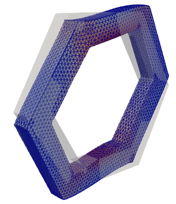

# Effective Elastic Properties of Wood at Micrometer Scale

This repository contains a FEniCSx-based simulation for determining the effective elastic properties of wood at the micrometer scale. To this end, a unit cell geometry in the form of a hexagonal prism is considered. The cell features a prescribed wall thickness, with an outer  and an inner layer.

The main challenges of this simulation are:

- Modeling the three-dimensional geometry with periodic boundary conditions
- Combination of different materials, including orthotropic materials 
- Capturing the effective  orthotropic material behavior

## Project structure

- `data/`   : Example data for material properties
- `scripts/`: Python simulation scripts for FEniCSx 
- `gmsh/`   : Python scripts for mesh generation using gmsh API
- `results/`: Output files (add to .gitignore)
- `docker/` : Docker instructions
- `docs/`   : Documentation files
- `tests/`  : Unit or integration tests

## Contributors & Acknowledgements

This work is related to the project **“Advancing mass timber and precast concrete-timber building research by multi-physics and multi-scale engineering computations and large-scale experimental studies”**  
(**Anillo Tecnológico ANID Chile**), directed by **Erik Saavedra** (Universidad de Santiago de Chile, USACh), in which **Rodolfo Venegas** (Universidad Austral de Chile, UACh) forms part.

### Repository Contributors

- Uwe Muhlich (https://www.uach.cl) — Code development, simulations, documentation
- Rodolfo Gustavo Venegas Castillo  (https://www.uach.cl) — Research collaborator (UACh) on the project Anillo,  ANID, which inspired this work
- Claudio Andrés Caamaño Parra (https://www.uach.cl)  Comsol simulation development 
